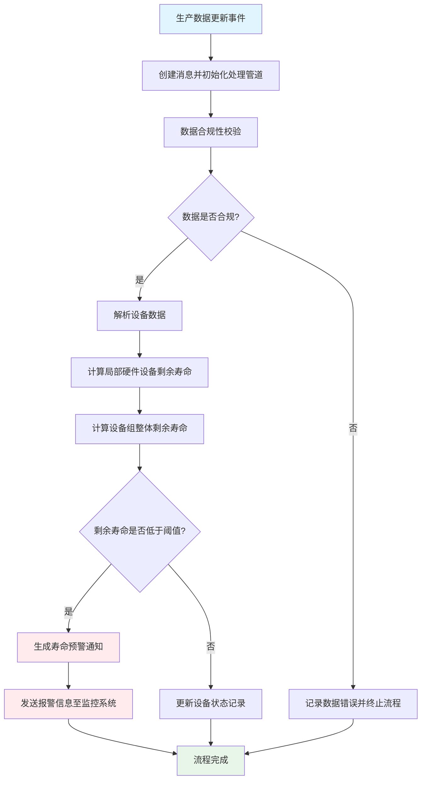

# 生产设备剩余寿命计算流程

## 流程图

## 流程说明

### 1. 消息创建与管道初始化
- 生产数据更新事件触发消息创建
- 初始化处理管道，准备进行后续计算

### 2. 数据合规性校验
- 验证数据格式和完整性
- 检查数据值域是否在合理范围内
- 确认数据时间戳有效性

### 3. 局部硬件设备剩余寿命计算
- 基于设备运行时间、负荷强度等参数
- 应用设备特定寿命模型算法
- 计算单个设备的剩余使用寿命

### 4. 整体设备组剩余寿命计算
- 聚合相关设备的寿命数据
- 考虑设备间的依赖关系和权重
- 计算设备组的整体剩余寿命

### 5. 寿命预警与报警
- 对比预设的预警阈值
- 生成相应级别的预警通知
- 发送报警信息至监控系统和相关人员

## 关键参数说明

| 参数类型 | 说明 |
|---------|------|
| 设备运行数据 | 运行时长、负荷强度、故障次数等 |
| 寿命模型参数 | 设备类型、设计寿命、衰减系数等 |
| 预警阈值 | 警告阈值、严重阈值、临界阈值等 |
| 设备组权重 | 设备在组内的重要性权重系数 |

## 应用场景

此流程适用于：
- 智能制造设备的预测性维护
- 工业生产线的设备健康管理
- 关键设备的寿命监控与预警
- 设备更换和维修计划的决策支持